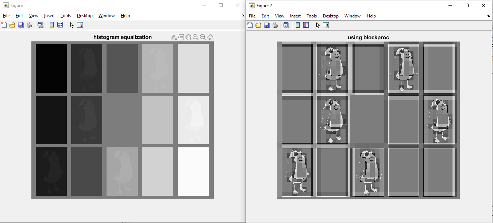

# ROBT310_image_processing

# Image Processing (ROBT 310): Homework Project 2
Matlab version R2020a
## Description
The homework project 2 consists of two parts: 
1) warm up part and
 Warm-up part:
 1.1 Implement Nearest-Neighbor Interpolation technique for a gray-scale image
 1.2 Histogram equalization 
2) main part:
 Visual illusion
 Floyd–Steinberg dithering:
 “Dither is an intentionally applied form of noise used to randomize quantization error, preventing largescale patterns such as color banding in images.”

# Warm-up: Part 1
# 1.1 Nearest-Neighbor Interpolation technique
1.1) A grayscale image was taken and enlarged using Nearest-Neighbor Interpolation technique.
All detailed comments and description in the code.

# 1.2 Histogram equalization
As you can see the by applying histogram equalization we enhance the contrast of an image
so looking at grey rectangles, I can see some alien, however before I could not see him much

And using blockproc I can clearly see this strange alien
so results are different, because when we have applied histogram
equalization, it affected to the whole image, i.e. the cumulative distribution
function (cdf) of entire image (as one block) was impacted 
and when blockproc was used, the cdf of a block with the size 40 by 40 is
only used. That is why when the block (40*40) with alien was affected
by histeq, this block was enhanced and alien is appeared.

# The main part:

# Part 2: Visual illusion
“Dither is an intentionally applied form of noise used to randomize quantization error, preventing largescale patterns such as color banding in images.”
